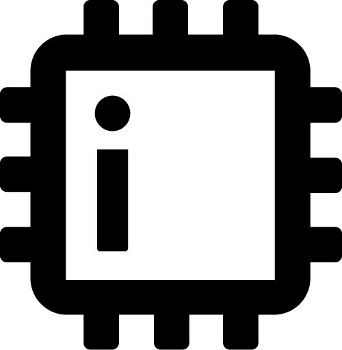
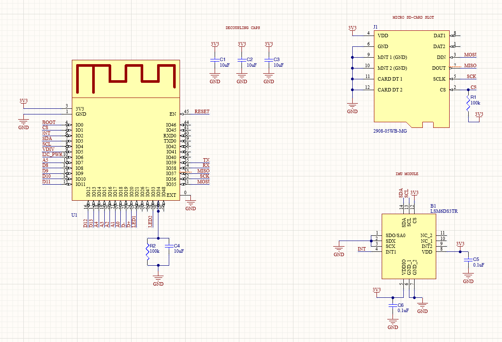

# iotaCore Microcontroller

## Overview

The iotaCore is an open-source microcontroller platform designed for IoT applications, combining powerful processing capabilities with extensive connectivity options in a compact form factor.

### Key Features

- **Processor**: ARM Cortex-M4 running at 120MHz
- **Memory**: 512KB Flash, 128KB RAM
- **Connectivity**: 
  - WiFi 802.11 b/g/n
  - Bluetooth 5.0 LE
  - USB-C
- **I/O**:
  - 6 Digital pins
  - 6 Analog inputs
  - 1 UART interface
  - 1 I2C bus
  - 1 SPI bus
- **Power**: 
  - USB-C powered
  - LiPo battery support with charging circuit
  - Low power sleep modes
- **Dimensions**: 50mm x 50mm

## Getting Started

### Hardware Setup

1. Connect your iotaCore to your computer using a USB-C cable
2. The onboard LED should pulse blue indicating proper power
3. Your computer should recognize the device as a serial port

## Hardware

### Schematic

The complete hardware design files are available in the [hardware repository](https://github.com/Mister-Industries/iotaCore/tree/main/Hardware), including:
- Schematic files 
- PCB layout files (Altium/KiCad format)
- Bill of Materials (BOM)
- Manufacturing files (Gerber)
- Assembly instructions

### Pin Mapping

| Pin | Function | Notes |
|-----|----------|-------|

## Development

### Contributing

We welcome contributions! Please see our [Contributing Guide](CONTRIBUTING.md) for details on:
- Code style guidelines
- Development workflow
- Testing requirements
- Pull request process

## Community

- [Discord Server](https://discord.gg/AccV9wfX)
- [Bluesky](https://bsky.app/profile/mr.industries)

## License

This project is licensed under the MIT License - see the [LICENSE](LICENSE) file for details.

## Acknowledgments
The iotaCore project thrives thanks to the generous support of our manufacturing and development partners:
### --- PCBWay ---

PCBWay provides exceptional PCB manufacturing services and has been instrumental in bringing iotaCore to life through their reliable prototyping capabilities. You can order our open-source designs directly from [their website](https://www.pcbway.com/project/shareproject/iota_The_Open_Source_Advanced_IoT_Learning_Platform_12776757.html)

Special thanks to:
- The Adafruit team for inspiration
- All our open source contributors

## Support

- [Issue Tracker](https://github.com/iotacore/iotacore/issues)
- Support Email: support@mr.industries
